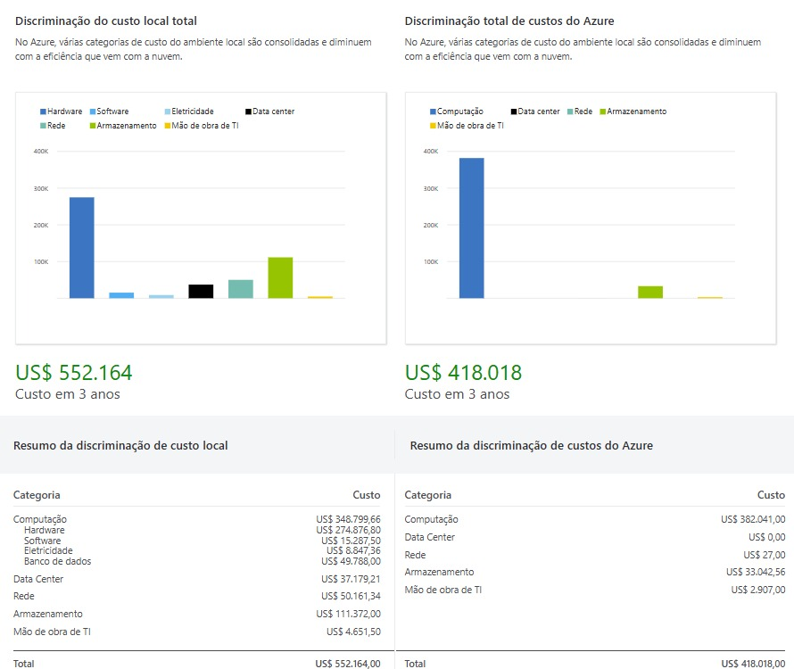
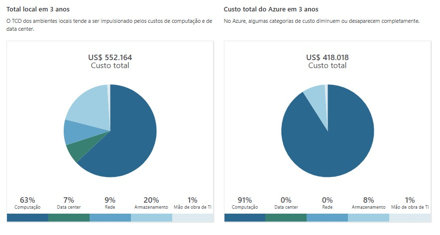
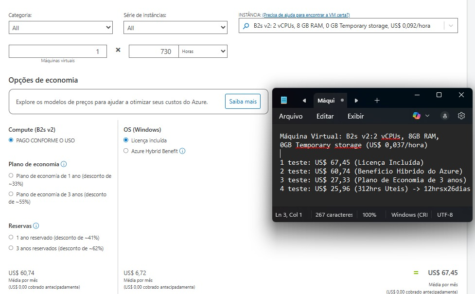

# 💰 Gerenciamento de Custos na Nuvem Azure

## ✨ Introdução

Este projeto tem como objetivo demonstrar como **gerenciar os gastos dentro da nuvem do Microsoft Azure**, utilizando ferramentas oficiais para estimativas e comparações de custo. A análise considera cenários de infraestrutura local versus serviços em nuvem, destacando oportunidades de economia e otimização.

---

## 🛠️ Ferramentas Utilizadas

🔹 **Calculadora do TCO (Custo Total de Propriedade)**  
Compara os custos de manter uma infraestrutura local com os custos de migrar para a nuvem Azure ao longo de 3 anos.

🔹 **Calculadora de Preços do Azure**  
Estima os custos de máquinas virtuais e outros recursos com base em diferentes configurações e planos de economia.

---

## 📊 Comparativo de Custos

### 💡 Custo Total em 3 Anos — Local vs Azure

A imagem abaixo apresenta uma comparação detalhada entre os custos de infraestrutura local e os custos na nuvem Azure:

---

### 🧮 Distribuição Percentual do TCO

A seguir, uma visão percentual dos custos totais de propriedade (TCO) para ambientes locais e em nuvem:

---

### 🧪 Simulações de Testes com Máquinas Virtuais

Utilizando a Calculadora de Preços do Azure, foram feitas simulações com diferentes quantidades de testes em máquinas virtuais do tipo **B2s v2** (2 vCPUs, 8 GB RAM):

| 🧪 Testes | 💸 Custo Estimado | 📋 Plano |
|----------|------------------|----------|
| 1 teste  | US$ 67,43        | Plano de economia |
| 2 testes | US$ 134,86       | Benefício Híbrido do Azure |
| 3 testes | US$ 202,29       | Plano de economia |
| 4 testes | US$ 269,72       | 12h Testes Úteis |
| 5 testes | US$ 337,15       | 12h Testes Úteis |

---

## ✅ Conclusão

A análise mostra que **migrar para a nuvem Azure pode representar uma economia significativa** ao longo do tempo, especialmente em cenários com alta demanda computacional. As ferramentas da Microsoft permitem uma estimativa precisa e ajudam na tomada de decisão estratégica.

---

## 📎 Extras

🔗 [Calculadora de Preços do Azure](https://azure.microsoft.com/pt-br/pricing/calculator/)  
🔗 [Calculadora de TCO do Azure](https://azure.microsoft.com/pt-br/pricing/tco-calculator/)

---

