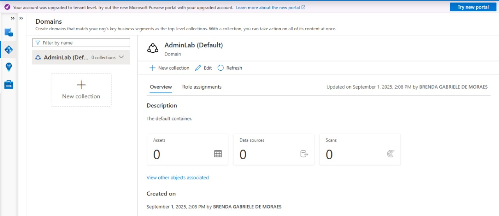
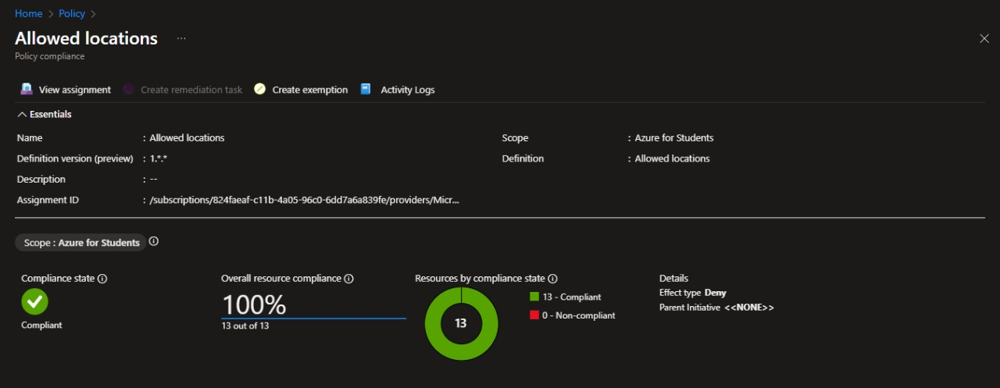
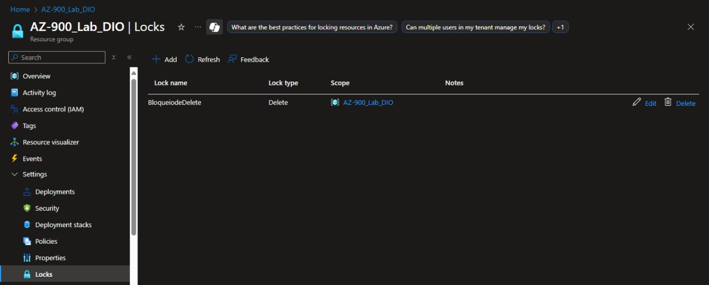

🚀 Projeto: Governança e Proteção de Recursos no Azure

Este projeto demonstra como aplicar boas práticas de governança e segurança em um Resource Group no Azure, utilizando:

🔹 Microsoft Purview

🔹 Azure Policies

🔹 Resource Locks

📌 Visão Geral do Projeto

Este repositório tem como objetivo apresentar um exemplo prático de governança no Azure.
Aqui você encontrará:

Como configurar o Microsoft Purview.

Como aplicar Azure Policies para padronização.

Como proteger recursos com Resource Locks.

✅ O que foi feito no projeto

📊 Microsoft Purview

Criação de um Purview associado ao Resource Group.

Objetivo: mapear, catalogar e organizar dados para dar mais visibilidade e suporte à conformidade.

🛡️ Azure Policies

Definição de políticas para permitir a criação de recursos somente em regiões específicas.

Benefício: garantir que todos os recursos sigam um padrão organizacional e de governança.

🔒 Resource Locks

Aplicação de um bloqueio do tipo CanNotDelete no Resource Group.

Resultado: proteção contra exclusões acidentais de recursos.

🌟 Benefícios alcançados

🔐 Segurança: proteção contra exclusões indevidas.

📏 Governança: criação de recursos dentro de regras estabelecidas.

📂 Organização: dados estruturados e monitorados com o Purview.

🛠️ Tecnologias utilizadas

☁️ Microsoft Purview

🛡️ Azure Policies

🔒 Resource Locks

⚙️ Azure Resource Manager (ARM)

💻 Azure CLI / PowerShell

👉 Este projeto mostra como é possível proteger, organizar e padronizar recursos no Azure, unindo segurança e governança em nuvem.
